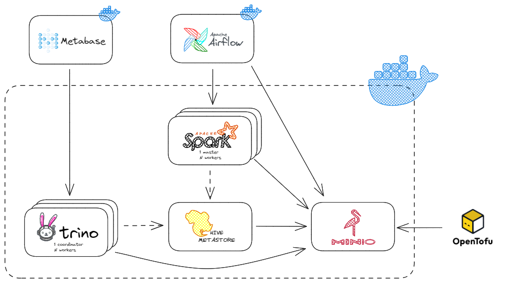
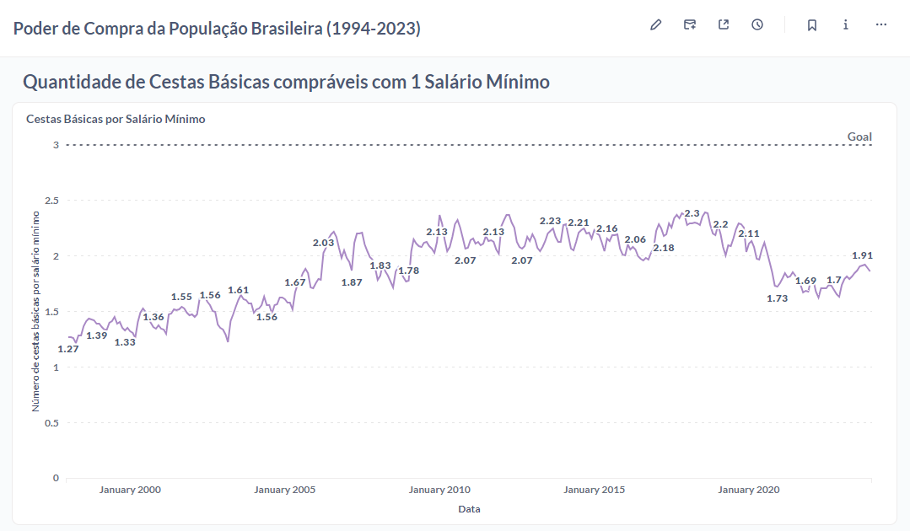

# Open Source Data Lake


This project creates a Big Data cluster using open source tools and it was designed for learning purposes.

Feel free to study or replicate the content here.

## Prerequisites (tested)
- Docker >= 25.0.4
- Docker Compose >= 2.24.7
- OpenTofu >= 1.6.2

## Available services
- Airflow
- Apache Spark
- Hive Metastore (HMS)
- Metabase
- MinIO
- OpenTofu
- Trino

## Project Architecture
Below we have an illustration of the project architecture, presenting the available services and their interactions.



## Getting started
Below we have a step-by-step guide on how to perform the services available in the project.

### Environment variables
Copy the `.env.default` file to `.env` and fill in the blank variables.
- POSTGRES_USER
- POSTGRES_PASSWORD
- MINIO_ROOT_USER
- MINIO_ROOT_PASSWORD (requires a moderate password)

### Common services
Create a network named datalake-network (only on first run).

```bash
docker network create datalake-network
```

Initialize all cluster services (This step may take a while to complete on the first run).

``` bash
docker compose up -d [--scale trino-worker=<num>] [--scale spark-worker=<num>]
```

> After the first startup, if you stop the service and want to start it again, you must prefix the variable `IS_RESUME=true` when invoking the `docker-compose up` command again. This will prevent HMS from trying to recreate your database.

Create MinIO Buckets (only on first run).

``` bash
tofu init
tofu plan
tofu apply -auto-approve
```

Create Data Lake schemas (only on first run).
``` bash
docker container exec datalake-trino-coordinator trino --execute "$(cat trino/schemas.sql)"
```

Now the cluster is ready!

### Airflow (optional)
Airflow was chosen as a tool for job orchestration, for the simple reason that it is open source and the most common on the market.

First you need to run the database migrations and create a user account. Just run the command below:

``` bash
docker compose -f docker-compose.airflow.yml up airflow-init
```

If you want to customize the Airflow project directory, simply update the `AIRFLOW_PROJ_DIR` variable in the `.env` to a directory of interest.

> The default directory is `./workspace`

Once airflow-init is finished, we can actually run Apache Airflow.

``` bash
docker compose -f docker-compose.airflow.yml up -d
```

Access the URL [http://localhost:8080](http://localhost:8080) in your browser and log in using the default authentication (`airflow`:`airflow`).

For more details, see the official [Airflow documentation](https://airflow.apache.org/docs/apache-airflow/stable/howto/docker-compose/index.html).

### Metabase (optional)
Metabase was arbitrarily chosen to create dashboards with BI tools. It can be executed with the command below:

```bash
docker compose -f docker-compose.metabase.yml up -d
```

Access the URL [http://localhost:3000](http://localhost:3000) in your browser. Create your user account and use Starbust to connect to the database (Trino).
- **Hostname:** datalake-trino-coordinator
- **Port:** 8080
- **Catalog (optional):** hive
- **Schema (optional):** raw|trusted|refined
- **Username:** metabase
- **Password:** no password is required

For more details, see the official [Metabase documentation](https://www.metabase.com/docs/latest/).

### Access links to service interfaces
|Service|URL|Auth|
|---|---|---|
|Metabase|http://localhost:3000|Create your own account|
|Airflow|http://localhost:8080|`airflow`:`airflow`|
|Trino UI|http://localhost:8081|Any username, no password is required|
|Spark UI|http://localhost:8082|None|
|MinIO|http://localhost:9001|`${MINIO_ROOT_USER}`:`${MINIO_ROOT_PASSWORD}`|


## How to submit spark jobs
To submit Spark jobs, you can use Airflow itself, which already has a customized operator for this [PySparkDockerOperator](workspace/dags/operators/pyspark_docker_operator.py).

But it is also possible to submit Spark jobs manually, by uploading the artifacts (source code and dependencies) to MinIO and executing the following command.

```bash
docker run -t --rm [-e <key>=<value>] --network datalake-network datalake-spark-image <spark-submit-command>
```

Template of a spark-submit command, considering that some settings are pre-defined in [spark-defaults.conf](spark/spark-defaults.conf).
```bash
spark-submit \
--name <job-name> \
[--conf <key>=<value>] \
... # other options
<s3-application-py> \
[application-args]
```

For more details, see the official [Submitting Applications documentation](https://spark.apache.org/docs/latest/submitting-applications.html).

### Example of use:
```bash
# Build pyfiles.zip
cd workspace/project
pip install -r requirements.txt -t pyfiles
cd pyfiles && zip -r pyfiles.zip *

# Upload artifacts to s3a://artifacts/salario_minimo using minio ui

# Spark job 1
docker run -t --rm -e BUCKET_DATALAKE_LANDING=datalake-landing --network datalake-network datalake-spark-image \
spark-submit \
--name raw_tb_salario_minimo \
s3a://datalake-artifacts/salario_minimo/pyspark_raw_salario_minimo.py

# Spark job 2
docker run -t --rm --network datalake-network datalake-spark-image \
spark-submit \
--name trusted_tb_salario_minimo \
--py-files s3a://datalake-artifacts/salario_minimo/pyfiles.zip \
s3a://datalake-artifacts/salario_minimo/pyspark_trusted_salario_minimo.py

# Check the status of running jobs at http://localhost:8082
```

Check the results using the [Trino CLI](https://trino.io/docs/current/client/cli.html#installation).

```bash
trino --server http://localhost:8081 --catalog hive
trino> select * from trusted.tb_salario_minimo limit 3;
#  vl_salario_minimo | nu_mes | nu_ano 
# -------------------+--------+--------
#              937.0 |      1 |   2017 
#             1039.0 |      1 |   2020 
#             1045.0 |      2 |   2020
# (3 rows)
```

## Proof of Concept
In the [workspace/project](workspace/project) directory, we have a project that serves as a demonstration of how the Cluster and Data Lake works. It consists of a simple data pipeline for ingestion, curation and refinement, demonstrating the interaction between Spark, Hive and MinIO.

Through the DAG [dag.poder_compra](workspace/dags/dag_poder_compra.py), the necessary artifacts for executing Spark jobs are uploaded (including the source code files and their dependencies) and all stages of the pipeline are executed, resulting in a final table called `trusted.tb_poder_compra`, which was explored using Metabase.


