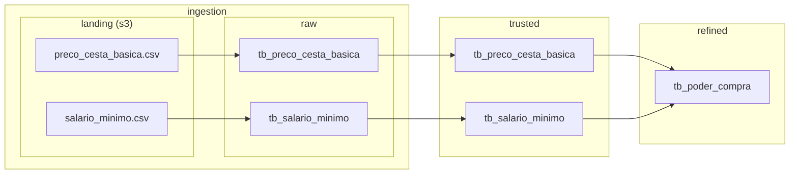

# Poder de compra da população Brasileira
Esse projeto tem como intuito estimar o poder de compra da população da região Sudeste do Brasil desde a implantação do Plano Real (1994) até o fechamento do ano de 2023. O estudo se dá através do cruzamento de informações do salário mínimo e do custo da cesta básica na região.

Abaixo temos um diagrama que representa o fluxo de ingestão, curadoria e refinamento dos dados.



## Ferramentas e serviços
Abaixo estão listados as ferramentas e serviços utilizados no projeto.

- Docker
- PySpark
- Pytest

## Getting Started
Para executar os testes unitários, utilize o comando abaixo.

```bash
sh ./workspace/project/test.sh [pytest options]
```

Para mais informações sobre o pytest, confira a [documentação oficial](https://docs.pytest.org/en/8.0.x/).

Sinta-se à vontade para modificar o Dockerfile ou qualquer outro arquivo do projeto.